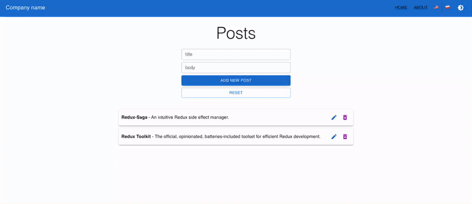

# react-redux-rtk-saga-materialui-typescript-starter

A boilerplate [Create React App](https://github.com/facebook/create-react-app)
with [Typescript](https://www.typescriptlang.org/), [Redux Toolkit](https://redux-toolkit.js.org/),
[Redux Saga](https://redux-saga.js.org/), [React Hook Form](https://react-hook-form.com/)
, [React-i18next](https://react.i18next.com/) and [Material UI](https://mui.com/).

## About



### Features

1. [React.js](https://reactjs.org/) CRUD example with Redux Saga.
2. [Typescript](https://www.typescriptlang.org/) for type safety
3. Core libraries
   * [Redux](https://redux.js.org/)
   * [Redux Toolkit](https://redux-toolkit.js.org/)
   * [Redux Saga](https://redux-saga.js.org/)
   * [Redux First History](https://github.com/salvoravida/redux-first-history)
   * [Redux Logger](https://github.com/LogRocket/redux-logger)
   * [React Router](https://reactrouter.com/)
   * [React Hook Form](https://react-hook-form.com/)
   * [Yup](https://github.com/jquense/yup)
   * [Axios](https://github.com/axios/axios)
   * [React-i18next](https://react.i18next.com/)
   * [MUI - Material UI](https://mui.com/)
   * [Styled Components](https://styled-components.com/)
4. Test libraries
   * [Jest](https://jestjs.io/)
   * [React Testing Library](https://testing-library.com/docs/react-testing-library/intro/)
   * [Redux Saga Test Plan](https://github.com/jfairbank/redux-saga-test-plan)
   * [Cypress](https://www.cypress.io/)
5. Other tools/libraries
   * [StoryBook](https://storybook.js.org/)
   * [Mock Service Worker](https://mswjs.io/)
   * [ESLint](https://eslint.org/), [Prettier](https://eslint.org/), [Lint-staged](https://github.com/okonet/lint-staged), [Pretty Quick](https://github.com/azz/pretty-quick)
   * [Husky](https://typicode.github.io/husky/#/)
   * [Commitlint](https://commitlint.js.org/#/)
   * [Standard Version](https://github.com/conventional-changelog/standard-version)
6. Opinionated folder structure
7. Internationalization for react app using [React-i18next](https://react.i18next.com/)
8. Material UI Dark Mode support

### Project Structure

```shell
./src
├── App.tsx # Application entrypoint
├── assets # assets folder contains all the static files (images, fonts, etc).
├── components # shared components
├── config # global configuration, env variables etc.
│   ├── Env.ts
│   └── i18n
├── features
│   ├── feature # 'feature'
│   │   ├── api # API folder contains http service calls
│   │   ├── assets # 'feature' assets folder
│   │   ├── components # 'feature' components
│   │   ├── hooks # 'feature' hooks
│   │   ├── index.ts # entry point for 'feature' public API
│   │   ├── store # 'feature' state stores contains slices, sagas, etc.
│   │   └── types # 'feature' typescript types
│   └── another_feature # 'another_feature'
├── hooks # shared hooks
├── libs # libraries imported or exported that can be used in different projects
│   ├── core
│   └── ui
├── pages  # contains all application pages
├── routes # routes configuration
├──  store # root store and store settings
└── test/ # contains test utilities and Mock Service Worker setup
    └── msw
```

## Getting Started

### Prerequisites

1. [nvm](https://github.com/nvm-sh/nvm)
2. [Node.js v17](https://nodejs.org/en/)
3. [Yarn](https://yarnpkg.com/)

### Installation

Install NPM packages:

```shell
yarn install
```

### Development

To start the application in the development mode run:

```shell
yarn start
```

> :memo: **Note:** Application starts in **sandbox-mode**, with all backend calls mocked by [MSW](https://mswjs.io/) library.
> To disable it change [REACT_APP_MSW_ENABLED](./.env) variable to false.

> :bulb: **Tip:** Open [http://localhost:3000](http://localhost:3000) to view application in the browser.

### Build

To build the application for production, run:

```shell
yarn build
```

### Testing

#### Unit / Integration tests

Launch the test runner in the interactive watch mode:

```shell
yarn test
```

See the section about [running tests](https://facebook.github.io/create-react-app/docs/running-tests) for more
information.

Run `yarn coverage` to generate code coverage.

#### E2E tests


To run e2e use below command:

```shell
yarn build && yarn test:e2e
```

> :memo: **Note:** This script will start the server, wait until application is running, execute e2e tests and after that it will shut down the server.

> :bulb: **Tip:** To run [Cypress](https://www.cypress.io/) in interactive mode, start the application and run `yarn cy:open`

### Story Book

Start Storybook in development mode:

```shell
yarn storybook
```

To build Storybook as static web application, run the following command inside project's root directory:

```shell
yarn build-storybook
```

> :bulb: **Tip:** run `npx http-server ./storybook-static` to preview static web application locally.

## Code Quality

### Overview

Running the script `yarn format` will format the code style of all TypeScript files.

The script `yarn lint` will run linter in the project. If any code standards or styles are not met in code, it will
display the errors or warnings.

Run `yarn lint:fix` command to format code and fix automatically any error found - if the linter knows how to fix it😉.

> :bulb: **Tip:** To enforce code conventions and prevent bad commits this project is setup to use Husky.
> Husky is used to run validation and format code before every commit.
> Additionally, it will check if git message is following [conventional commits](https://www.conventionalcommits.org/en/v1.0.0/) format.

### Absolute imports

Absolute imports should always be configured and used because it makes it easier to move files around and avoid messy
import paths such as `../../../Component`. Wherever you move the file, all the imports will remain intact.

To enable Absoulte imports in Intelij ide go to `Settings -> Editor -> Code Style -> TypeScript -> Imports` and
enable **Use paths relative to tsconfig.json**.

## Release

Create release version and generate a changelog file:

```shell
yarn release
```

> :memo: **Note:** use `yarn release:first-release` if this is the first release.

> :bulb: **Tip:**  `yarn release:dry-run` - allows you to see what commands would be run, without committing to git or updating files.

## Useful dev tools

- [React Developer Tools](https://chrome.google.com/webstore/detail/react-developer-tools/fmkadmapgofadopljbjfkapdkoienihi)
- [Redux DevTools](https://github.com/reduxjs/redux-devtools)
- [Testing Playground](https://chrome.google.com/webstore/detail/testing-playground/hejbmebodbijjdhflfknehhcgaklhano)
- [Window Resizer](https://chrome.google.com/webstore/detail/window-resizer/kkelicaakdanhinjdeammmilcgefonfh)
- [React Hook Form - form builder](https://react-hook-form.com/form-builder)
- [i18next-scanner](https://github.com/i18next/i18next-scanner)

## References

- [TypeScript Deep Dive](https://basarat.gitbook.io/typescript/)
- [React+TypeScript Cheatsheets](https://github.com/typescript-cheatsheets/react)
- [Redux - style guide](https://redux.js.org/style-guide/style-guide)
- [Redux Toolkit - Getting Started](https://redux-toolkit.js.org/introduction/gettiĻng-started)
- [React Hook Form - typescript Support](https://react-hook-form.com/ts)
- [Bulletproof React](https://github.com/alan2207/bulletproof-react)
- [Jest cheat sheet](https://github.com/sapegin/jest-cheat-sheet)

## Additional Links

- [React Hook Form vs. Formik: A technical and performance comparison](https://blog.logrocket.com/react-hook-form-vs-formik-comparison/)
- [MUI - theme switcher](https://mui.com/customization/dark-mode/)
- [Level up your CSS linting using Stylelint](https://blog.logrocket.com/using-stylelint-improve-lint-css-scss-sass/)
- [Create React App: A quick setup guide](https://blog.logrocket.com/create-react-app-a-quick-setup-guide-b812f0aad03c/)
- [Using TypeScript with Redux Toolkit](https://blog.logrocket.com/using-typescript-with-redux-toolkit/)
- [What is Redux Ducks?](https://medium.com/@matthew.holman/what-is-redux-ducks-46bcb1ad04b7)
- [Redux DevTools: Tips and tricks for faster debugging](https://blog.logrocket.com/redux-devtools-tips-tricks-for-faster-debugging/)

